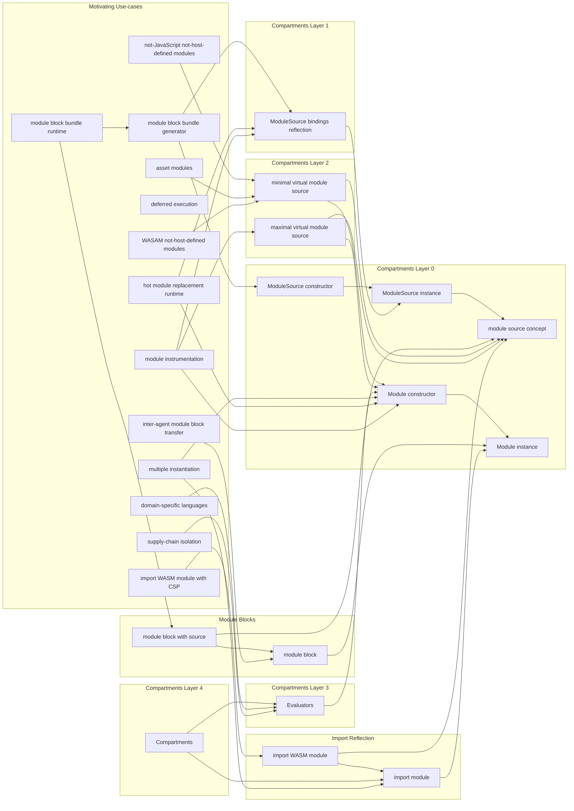

# Motivating uses cases for module proposal features



# Motivating Use-cases

## Non-JavaScript not-host-defined modules

Hosts may enable non-JavaScript modules to participate in the JavaScript module
graph.
Web hosts, for example, may enable JSON and WASM.
If JavaScript were to enable user code to implement non-JavaScript module
sources, these and other languages could participate on host implementations
that did not anticipate these features, and allow user code to explore the
range of useful module kinds ahead of host implementations, accelerating
the evoluation of the JavaScript ecosystem.

Of the current proposed language features, the language would need:
***a minimal virtual module source protocol***.
The minimal protocol would enable non-JavaScript languages that do not need
JavaScript features like cyclic dependencies, lazy bindings, or early
initialization of hoisted declarations.
The ***maximal virtual module source protocol*** would be sufficient for
emulating JavaScript in JavaScript and any other language that benefits from
these behaviors.

## Asset modules

Asset modules are non-JavaScript not-host-defined modules as in the above
motivating use case, but merit specific consideration since module source
virtualization is sufficient to unlock their use cases, although other
mechanisms are possible.

Consider some possible non-JavaScript asset modules:

- Binary modules could export a default array buffer.

- Text modules could export decoded text as a default export.

- An image module could export a default representation of an image, a blob
  reference to an image, a URL, or a file system path to the image.
  Incorporating images and similar resources in the JavaScript module graph
  ensures that a program is portable between development and production
  environments, allowing a JavaScript bundler to observe the dependency on an
  image asset.

- JSON modules test the boundary between a language and an asset or resource.
  They do not have dependencies or side-effects.
  Their behavior is much more like decoding than evaluation.

- One valid interpretation of a CSS module would be to incorporate a
  style sheet in the surrounding web page as a side effect of evaluation.
  Such a module would export nothing but allow a bundler to observe the
  dependency and ensure a topological order to the included sheets.
  The module might also export a representation of the generated sheet as a
  mutable resource.

  Style sheets have their own notion of dependencies, and a valid
  interpretation of a CSS module might subvert CSS imports and allow
  CSS modules to benefit from JavaScript module resolution,
  such that a bundler can relocate resources between development and
  production.

## WebAssembly not-host-defined modules

Not all hosts necessarily implement the web's specifications for allowing
WebAssembly to participate in the JavaScript module graph.
As above, ***a minimal virtual module source protocol*** would allow
user code to emulate the standard behavior for Web Assembly.

## Deferred module execution

With ***static `import module`*** syntax and a ***`Module` instance***, a
module can express a dependency on a module and arrange for any of it and its
transitive dependencies to execute if they have not already.

```js
import module example from 'example';

await import(example);
```

Similar can be achieved with ***dynamic `import.module`*** syntax
to additionally control the time that the entry-point module gets fetched and
parsed.

```js
const example = await import.module('example');
await import(example);
```

This solves only the least ambitious leading portion of the [Deferred module
evaluation proposal][defer-module-eval], and does not address lazy
initialization or evaluation.

## Module multiple-instantiation

The ***`Module` constructor*** paired with the ***concept of a module source***
enables a program to create any number of instances of a module.
By controlling the module's shallow import behavior (`importHook`), each
instance can be linked to different instances of its dependencies, share
dependencies, and even share dependencies loaded by the host's default import
behavior.

```js
await import(new Module(moduleSource));
await import(new Module(moduleSource));
```

Multiple-instantiation depends on one of many possible mechanisms for
obtaining a suitable module source, all of which must have a [[ModuleSource]]
internal slot referring to a ***Module Source Record***.

Many of these mechanisms rely on a `Module` instance to have a `source`
property.
For example, ***`module` blocks***, ***static `import module`***, and
***dynamic `import.module`*** syntax all produce a `Module` instance, which
_may_ in turn possess a `source` property that is a valid module source.

```js
import module example from 'example';
// or
const example = await import.module('example');
// or
const example = module {};

const moduleSource = example.source;
```

We allow for the possibility that the host (or virtual host) may not provide a
`source` for a `Module` instance, either because one does not exist, or it does
exist but it would not be useful, breaks encapsulation, or would betray
confidence.

Platforms like XS, which might not have a `ModuleSource` constructor, would
still be able to produce `ModuleSource` instances, backed by pre-compiled byte
code.

Programs could also obtain a `ModuleSource` instance directly, parsing some
given text.
This last option would not benefit from origin host data and would not be
possible in combination with a production no-unsafe-eval policy.
A ***`ModuleSource` constructor that accepts trusted types*** would overcome
that limitation.

```js
const moduleLocation = import.meta.resolve('example');
const moduleResponse = await fetch(moduleLocation);
const moduleText = await moduleResponse.text();
const moduleSource = new ModuleSource(moduleText);
```

## Hot-Module-Replacement (HMR)

Hot-Module-Replacement is a common tool that allows a page to reload the
portion of a module graph that has changed over the course of active local
development.
Implementing Hot-Module-Replacement with a first-class module system
in JavaScript requires a ***`Module` constructor***, the ***concept of a
module source***, and ***`ModuleSource` `bindings` reflection***.
As with other cases of ***module multiple instantiation***, any module source
will do, though the most obvious tool would be the ***`ModuleSource`
constructor***, which should always be suitable for development.

A hot-module-replacement system watches for changes to files that it
has previously loaded, their dependency graph, and the co-graph (the inverse
adjacency matrix of the dependency graph).
Each time a file changes, it invalidates the corresponding module
and its transitive dependees (not dependencies), which will presumably
include the entrypoint module of the application, then reconstructs
the application, reusing the portion of the graph that has not changed.
***`ModuleSource` `bindings` reflection*** allows the system to incrementally
update the dependency graph and co-graph.

The ***`import.meta` injection*** in the ***`Module` constructor*** is
necessary to allow an HMR implementation to inject module-specific hooks for
handing off state from one version to the next.

## Module block bundle generator and runtime

Production web applications often bundle multiple sources into a single file or
even an inline script to minimize user-perceived latency.
***Module blocks*** and ***`ModuleSource` `bindings` reflection*** afford new ways
to generate and interpret bundles.

A module bundle generator can use the ***`ModuleSource` constructor*** to
and ***`ModuleSource` `bindings` reflection*** to statically analyze
a module graph in one host and then construct a bundle that uses ***`module`
blocks*** to parse all of these modules in a way that preserves their origin
host-data.

Nicolò&nbsp;Ribaudo has
[sketched](https://gist.github.com/nicolo-ribaudo/81f18db096659ac8447ca94f50f2c37a)
one such implementation.

## Import WASM (`WebAssembly.Module`) with Content-Security-Policy (CSP)

The primary motivation of the [Import Reflection proposal][import-reflect]
is to provide a mechanism that allows a program to get a `WebAssembly.Module`
object with host-provided origin information such that the module can
be later manually linked and executed under a no-unsafe-eval
Content-Security-Policy.

With ***static `import module` syntax***, support for ***`Module` instances***,
and the ***concept of a module source***, the host can arrange for `WebAssembly.Module`
to have a `[[ModuleSource]]` internal slot, referring to a ***WebAssembly
Module Source Record***, implementing the abstract ***Module Source Record***.
Both static `import module` and dynamic `import.module` syntax would produce a
`Module` instance with a `WebAssembly.Module` for its `source`.  The net effect
is that user code can both defer execution of the web assembly module and get a
reference suitable for manually linking the `WebAssembly.Module`.
Both cases work under a Content-Security-Policy and both allow a bundler to
statically observe the dependency.

```js
import module example from 'example.wasm';

example.source instanceof WebAssembly.Module; // true

await import(example); // also supported
```

## Inter-agent module block transfer

The primary motivation for the [Module Blocks proposal][module-block] is to
enable a program to send a module to another agent for execution.
In this system of proposals, the ***`module` block with source*** feature would
produce a ***`Module` instance*** with a corresponding ***`ModuleSource` instance***.

The module instance _can_ be executed locally, but in combination with a mechanism
for serializaing and transferring the source and host-specific metadata (like
the referrer, `import.meta.url`, and (signed) origin, between web host agents),
the module can be executed in another agent (like a worker on the web).

Using the ***`Module` constructor*** and ***`ModuleSource` constructor***, user
code can orchestrate the transfer and execution of module sources, metadata,
and dependency graphs.

## Module instrumentation

One of the bottlenecks for adoption of ESM over CommonJS is instrumentation.
Currently, there are well-known solutions to creating a mock or thunks for all
the API exported by a CommonJS module.
A ***maximal virtual `ModuleSource` protocol*** and ***`ModuleSource` bindings
reflection*** would allow user code to create adapters from one module instance
to another.
The maximal protocol is necessary to fully emulate JavaScript, including cyclic
dependencies, temporal dead zones, initialization of hoisted declarations, and
lazy bindings and requires two phases.

## Domain-Specific-Language (DSL) scripts and modules

Domain-Specific-Languages like Jasmine and Jest provide global functions like
`describe` and `it`.
These globals are only needed in the entrypoint module but are visible
throughout the application.
Also, because these are global, implementations must keep track of the
currently executing module to associate `describe` calls with the correct
context, effectively dynamic scope.
Concurrently executing multiple entrypoints is not safe because `describe`
functions are not reentrant.
Using separate realms can mitigate this problem, but creates other problems,
like identity discontinuity between types from separate realms.

Domain-Specific-Language implementations would benefit from the ability
to execute modules and scripts in a context that has the same Realm and
intrinsics but a user-defined global.

```js
const evaluators = new Evaluators({
  __proto__: globalThis,
  describe(subjectDescription) {},
  it(behaviorDescription) {},
});
const spec = await import.module('example-spec.js');
await import(new evaluators.Module(spec.source));
```

The above example uses ***dynamic `import.module` syntax*** to
obtain the module source for the entrypoint module without executing it,
then uses the ***`Module` constructor*** obtained from a new batch
of ***Evaluators*** to run it with an alternate global environment.

## Supply-chain isolation

Software supply-chain attacks, attacks on the integrity of package managers
like `npm`, allow hostile programmers to introduce arbitrary code into the
transitive dependencies of large numbers of applications when they upgrade
their dependencies, nominally to patch security flaws.
This puts application developers in an awkward catch-22: Are we safer upgrading
frequently or infrequently?
It has become impractical for application developers to audit all of their
application, much less their tooling, to ensure they only let good software
into their supply chain.

With ***Evaluators*** and pervasive freezing of shared JavaScript intrinsic
objects, a program can arrange for each of their third-party dependencies to
execute in an inescapable environment with limited access to powerful globals
and module dependencies.
Furthermore, static analysis allows us to generate human-meaningful assessments
and policies for the needs of third-party packages in order to both assess the
risk of an attack and to enforce access to only the powers that they appear to
need.

***Compartments*** provide a higher level abstraction for the same functionality
as ***Evaluators*** and ***dynamic `import.module` syntax***.

# Features

## Compartments Layer 0: First-class `Module` and `ModuleSource`

### module source concept

Any object with a [[ModuleSource]] internal slot of type ***Module Source
Record*** is conceptually a module source.
Module source records capture the module's bindings for linking to other
modules and their initialization and execution behaviors, but are otherwise
sufficiently abstract that JavaScript modules, host-defined module sources,
and virtual module sources can all participate.

Specifically, a `WebAssembly.Module` is an existing host-defined class that can
become a module source with the addition of a suitable [[ModuleSource]]
internal slot.

In the fullness of the Module Harmony epic, the `Module` constructor would
accept any such module source and `Module` instances may have a `source`
property that is any module source type.

However, there are some cases where a `Module` instance would not
have a `source` or where its source should be redacted.
For example, host-defined modules, like the Node.js `internal*` modules, might
not necessarily have a source.

Whereas, a module block would have a `source`.
We have not yet concluded whether a lexically named module fragment could have
a `source`.

### `ModuleSource` instance and prototype

The `ModuleSource` instance is a handle for a JavaScript module source.
The object has a [[ModuleSource]] internal slot that refers to a ***Module
Source Text Record*** which concretely implements the ***Module Source
Record*** abstract interface.

Module source instances are sufficient to represent a parsed module
for the purposes of both static `import module` and dynamic `import.module`
syntaxes for the [Import Reflection Proposal][import-refect]
and provide a basis for a `ModuleSource` constructor.

### `ModuleSource` constructor

The `ModuleSource` constructor parses text and generates a `ModuleSource`
instance.
Because the text is arbitrary, the `ModuleSource` constructor cannot imbue its
***Module Source Text Record*** with an origin for its [[HostData]] internal
slot and the module cannot be executed with a `no-unsafe-eval`
Content-Security-Policy.

### `ModuleSource` constructor and trusted types

The `ModuleSource` constructor could provide an origin for its ***Module Source
Text Record***'s [[HostData]] internal slot if instead of receiving text it
received text from the [W3C Trusted Types][trusted-types] proposal.

### `Module` instance and prototype

Module instances represent the lifecycle of an instance of a module.
A single module source can produce multiple module instances in multiple realms
and multiple agents, but a module instance corresponds to the singleton linking
and execution of that source in a context.

Module instances are useful for anchoring ***`module` blocks***, ***static
`import module` syntax***, and ***dynamic `import.module` syntax***, even
if there is no `Module` constructor.

### `Module` constructor

The `Module` constructor unlocks deferred execution and multiple instantiation
of module sources as well as linking those intances in virtualized host import
hooks.

### `import.meta` injection

The `Module` constructor must also virtualize the behavior of `import.meta`
expressions when the module gets evaluated.

## Module Blocks

### `module` block

A `module` block produces a ***`Module` instance*** that can be executed later,
possible multiple times, possibly on another agent.

### `module` block with `source`

A `module` block with a `source` allows user code to extract the source
and potentially transport it independent of its instance metadata or linkage.

## Import Reflection

### Static `import module` and dynamic `import.module`

These syntaxes would produce ***`Module` instances*** which may have a `source`
property that is a ***module source concept*** at the host or virtual host's
discretion.

```js
import module example from 'example';
// or
const example = await import.module('example');

// then
example instanceof Module; // true
example.source instanceof Module; // if example is JavaScript
```

### Import `WebAssembly.Module`

Building upon `import` `module`, the ***module source concept*** is sufficiently
flexible that the existing `WebAssembly.Module` can implement it by providing a
[[ModuleSource]] internal slot containing a ***WebAssembly Module Source
Record***.
The host can go farther by implementing a `WebAssembly.Module.prototype.bindings`
property that reflects the imports and exports of the WASM module
with the equivalents of ***`ModuleSource` `bindings` reflection*** such
that bundlers and other static analyzers can trivially accommodate Web Assembly
module sources.

## Compartments Layer 1: `ModuleSource` bindings reflection

### `ModuleSource` bindings reflection

Binding reflection allows JavaScript programs to analyze the imports and
exports of a JavaScript module source.
Programs like bundlers require this information.
The `import` behavior for `Module` instances uses the same information to drive
the `importHook`.

## Compartments Layer 2: Virtual module sources

### Minimal virtual module source

We can extend the ***module source concept*** to include virtual module sources,
module sources implemented in JavaScript that do not have a [[ModuleSource]]
internal slot.
A protocol that emulates ***`ModuleSource` `bindings` reflection***
and provides a hook for its execution phase is sufficient to model languages
that do not support dependency cycles, initialization of hoisted declarations,
and lazy bindings.
Some modules can consist entirely of `bindings` (like `exportAllFrom`),
execution behavior, or neither.
The ***`Module` constructor*** would need to evolve to accept these virtual
module sources.

We can arrive at a suitable emulation of CommonJS using heuristic static analysis
and allow such CommonJS modules to fully participate in a module graph, both
importing and exporting any other kind of module.
This will not fully interoperate with all legacy Node.js CommonJS modules
because of its dependency on static analysis, but will be sufficient to hoist a
subset of the CommonJS ecosystem into the future and ease migration.
This system can coexist with a synchronous legacy CommonJS loader.

### Maximal virtual module source

The minimal virtual module source is not sufficient to fully emulate JavaScript
and full emulation of JavaScript is necessary for mock modules for ***module
instrumentation***.
Protocols like the one implemented by [SystemJS][system] are sufficient
for full emulation.

## Compartments Layer 3: Evaluators

### Evaluators

The `Evaluator` constructor creates a new set of evaluator intrinsics: `eval`,
`Function`, and `Module`.
262 currently stipulates that `eval` and `Function` have a [[Context]] internal
slot through which they can reach the [[Realm]] for the evaluation behavior of
dynamic import.
We presume to extend that design to the new ***`Module` constructor***,
such that it can reach for the default dynamic and static import behaviors.
Evaluators would add a level of indirection from [[Context]] to [[Evaluators]]
to [[Realm]], such that there can be multiple sets of evaluators in a single
realm, each with their own global and module behavior.

Evaluators unlock two major use cases: better ***Domain Specific Languages***
and isolation of third-party dependencies, or ***supply chain isolation***.

## Compartments Layer 4: Compartments

Compartments are the high-level API out of which all prior layers of the
Compartments proposal fell.
For ***supply chain isolation*** in Node.js, a compartment corresponds
to a package.
Moddable's XS implements `Compartments` to allow a powerful embedded system
to delegate powers to guest comaprtments, such as preventing guest code
from drawing too much power.

Compartments can be implemented in user code provided the lower-level
***Evaluators***, the ***`Module`*** and ***`ModuleSource` constructor***, as
well as ***dynamic `import.module` syntax***.

[defer-import-eval]: https://github.com/tc39/proposal-defer-import-eval
[import-reflect]: https://github.com/tc39/proposal-import-reflection
[module-block]: https://github.com/tc39/proposal-js-module-blocks
[trusted-types]: https://www.w3.org/TR/2022/WD-trusted-types-20220927/
[system]: https://github.com/systemjs/systemjs
